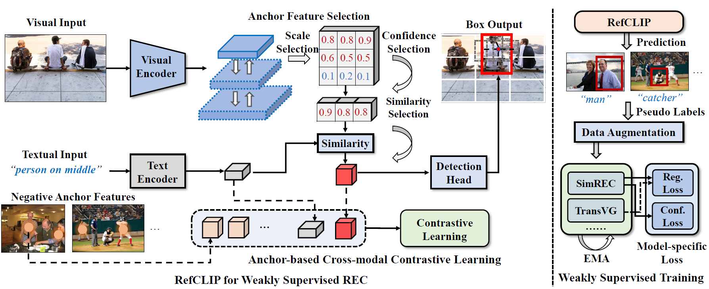

# RefCLIP
[](https://www.python.org/)


This is the official implementation of "RefCLIP: A Universal Teacher for 
Weakly Supervised Referring Expression Comprehension", 
which redefines REC as an anchor-text matching problem and achieves weakly supervised
optimization via anchor-based contrastive learning.

<p align="center">
	
</p>

## Installation
- Clone this repo
```bash
git clone https://github.com/AnonymousPaperID5299/RefCLIP.git
cd RefCLIP
```

- Create a conda virtual environment and activate it
```bash
conda create -n refclip python=3.7 -y
conda activate refclip
```
- Install Pytorch following the [official installation instructions](https://pytorch.org/get-started/locally/)
- Install apex  following the [official installation guide](https://github.com/NVIDIA/apex)
- Compile the DCN layer:

```bash
cd utils/DCN
./make.sh
```

```bash
pip install -r requirements.txt
wget https://github.com/explosion/spacy-models/releases/download/en_vectors_web_lg-2.1.0/en_vectors_web_lg-2.1.0.tar.gz -O en_vectors_web_lg-2.1.0.tar.gz
pip install en_vectors_web_lg-2.1.0.tar.gz
```

## Data Preparation
We will release the processed dataset and pretrained weights later.

## Training
```
python train.py --config ./config/[DATASET_NAME].yaml
```

## Evaluation
```
python test.py --config ./config/[DATASET_NAME].yaml --eval-weights [PATH_TO_CHECKPOINT_FILE]
```
